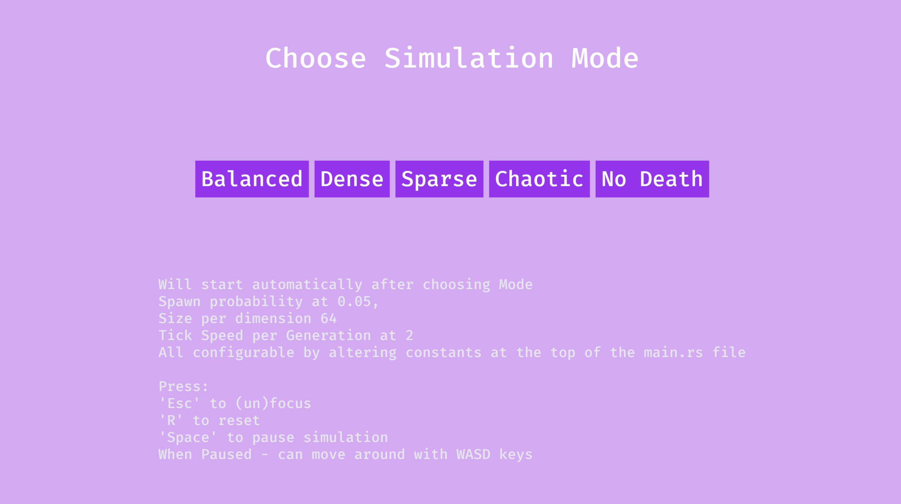
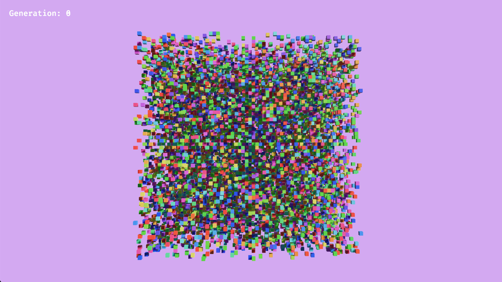
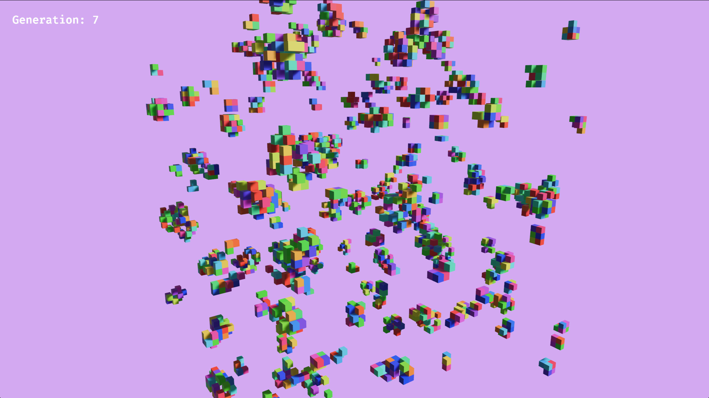
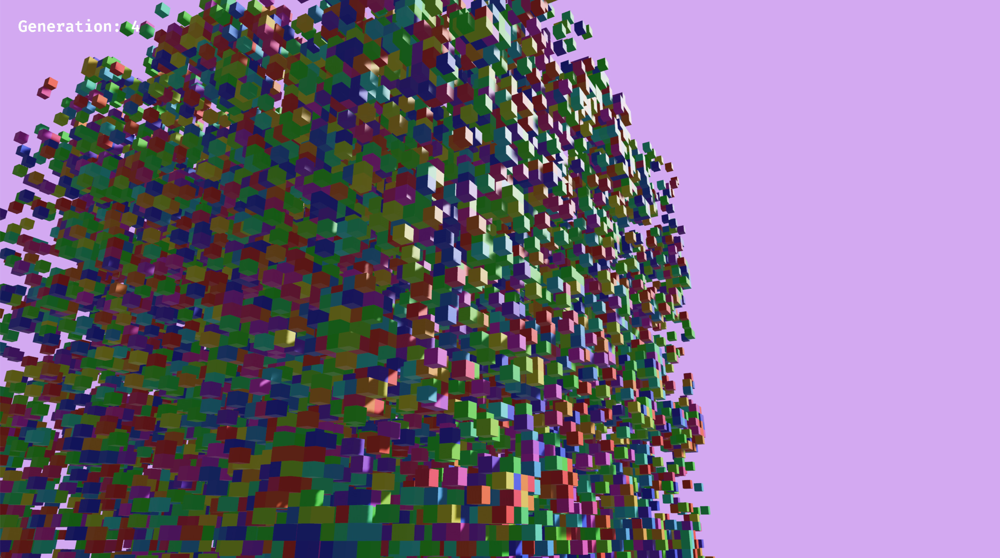

  <h1 align="center">Game Of Life</h1>

- [About](#about)
- [Install](#install)
- [Screenshots / Demo](#screenshots--demo)
- [Authors](#authors)

## About
A Simulation of Conway's Game of Life extrapolated to 3 Dimensions. Uses the bevy game engine to render both the ui and actual simulation. As there's no clearly defined ruleset for the 3d version, multiple ones are used and can be chosen, each displaying a different development, from randomly generated starting points.(Soon:) There exist also different starting rules with a predefined starting state/form to observe different shapes/results - which follow specific interesting patterns

Can be paused ,reset ,(un)focused during simulation, along with reactive speed adjustments.
When Paused - camera movable to inspect cubes (with WASD key), when reset camera teleported back to original position

## Install
clone repo and build (need rust compiler installed)

## Screenshots / Demo

## Authors

* ThatLukaszGuy

